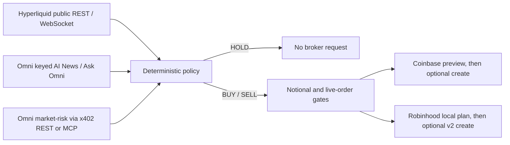

# Building Coinbase and Robinhood agents with Omni data

This guide takes an agent from market research to a guarded Coinbase Advanced Trade or Robinhood Crypto order. The examples are runnable TypeScript programs, not pseudocode. They default to no broker submission and keep the x402 buyer key, Omni API key, and broker credentials in separate trust domains.

These examples demonstrate integration and safety mechanics. They are not profitable strategies or investment advice.

## Architecture



The included broker agents use the enriched Omni `market-risk` product. Direct Hyperliquid and keyed Omni data are available for custom policies.

| Input | Access | SDK | Appropriate use |
| --- | --- | --- | --- |
| Hyperliquid instruments, candles, mids, trades and books | Public, direct | `HyperliquidPublicClient`, `HyperliquidWebSocketClient` | Commodity market data and technical features |
| Omni AI News and Ask Omni | `OMNI_API_KEY` | `OmniClient`, `OmniWebSocketClient` | Authenticated news, event streams and questions |
| Omni enriched market risk | Per-call x402 payment | `OmniX402Client` | Joined news, funding and market context |
| Omni enriched market risk for tool-using agents | Per-call x402 payment | `OmniMcpClient` | The same bounded research through MCP |
| Order execution | Broker credentials | `CoinbaseAdvancedTradeClient`, `RobinhoodCryptoClient` | Previewing or submitting the final bounded order |

Public Hyperliquid data goes directly to Hyperliquid. Omni does not receive Coinbase or Robinhood credentials, and broker clients do not receive the x402 buyer key.

## 1. Install

Node.js 20.19 or newer is required. The example commands use Node's optional environment-file loader so the same npm scripts work with a local `.env` file or injected deployment secrets.

```bash
git clone https://github.com/InTheta/omni-universe-sdks.git
cd omni-universe-sdks/packages/typescript
npm ci
cp .env.example .env
npm run verify
```

All `npm run example:*` commands load `.env` when present. Existing process environment values take precedence over the file.

Applications can install the verified release artifact instead:

```bash
npm install https://github.com/InTheta/omni-universe-sdks/releases/download/v0.8.0/omni-terminal-sdk-0.8.0.tgz
```

## 2. Configure research

The included agents make one paid `market-risk` request before deciding. Use a separate, spending-limited EVM wallet. Do not reuse a broker key or a wallet that holds material funds.

```dotenv
OMNI_APP_URL=https://omniterminal.app
OMNI_MCP_URL=https://omniterminal.app/api/x402/mcp
OMNI_RESEARCH_TRANSPORT=x402
EVM_PRIVATE_KEY=0x...
X402_MAX_PAYMENT_USD=0.01
RUN_PAID_RESEARCH=true
```

Set `OMNI_RESEARCH_TRANSPORT=mcp` to use MCP instead of x402 REST. Both paths call the same bounded product contract. `RUN_PAID_RESEARCH=true` is mandatory, and the example refuses a ceiling above `$0.01` per call.

To inspect all unpaid product challenges without spending:

```bash
npm run example:x402
npm run test:live
```

To purchase every x402 example route once, use `RUN_PAID_EXAMPLES=true`; this is separate from the single research-call flag used by broker agents.

## 3. Configure the decision policy

```dotenv
TRADING_SYMBOL=BTC
MAX_ORDER_NOTIONAL_USD=25
LIVE_TRADING=false
CONFIRM_LIVE_ORDER=
```

The public examples support `BTC`, `ETH`, `SOL`, and `HYPE`. They refuse an example notional above `$100`; the default is `$25`.

That symbol allowlist describes the Omni research product, not guaranteed venue availability. Confirm that `${TRADING_SYMBOL}-USD` is currently API-tradable at the selected broker before enabling live execution.

`decideFromMarketRisk()` is deterministic:

1. It weights each news item by normalized sentiment and confidence.
2. It returns `HOLD` below `0.72` confidence by default.
3. It returns `HOLD` when absolute hourly funding exceeds `0.001` by default.
4. Otherwise it produces `BUY` or `SELL` with the configured maximum notional.

Treat the output as an intent, not permission to trade. Production applications should add balance checks, position limits, daily loss limits, duplicate-order protection, monitoring, and human approval appropriate to their risk.

## 4A. Coinbase Advanced Trade

Create a Coinbase App Secret API Key in CDP. Coinbase currently requires ECDSA for Coinbase App APIs; restrict the key to the intended portfolio and permissions and use an IP allowlist where practical. Preserve the PEM newlines in the secret. The SDK accepts either real newlines or escaped `\n` sequences.

```dotenv
COINBASE_API_KEY=organizations/.../apiKeys/...
COINBASE_API_SECRET=<ECDSA PEM secret with escaped newlines>
```

Official references:

- [Coinbase App API-key authentication](https://docs.cdp.coinbase.com/coinbase-app/authentication-authorization/api-key-authentication)
- [Advanced Trade preview order](https://docs.cdp.coinbase.com/api-reference/advanced-trade-api/rest-api/orders/preview-orders)
- [Advanced Trade create order](https://docs.cdp.coinbase.com/api-reference/advanced-trade-api/rest-api/orders/create-order)
- [Advanced Trade static sandbox](https://docs.cdp.coinbase.com/coinbase-app/advanced-trade-apis/sandbox)

Run the agent:

```bash
node --env-file=.env --import tsx examples/agents/coinbase-agent.ts
# or
npm run example:coinbase
```

With `LIVE_TRADING=false`, a directional decision calls Coinbase's authenticated production preview endpoint and returns the preview plus proposed order. It does not call the create-order endpoint. A `HOLD` decision makes no Coinbase request. Because preview is authenticated, dry-run still requires a valid, appropriately permissioned Coinbase key.

The static Coinbase sandbox returns predefined mock responses. It is useful for response-shape integration but is not a simulated market and does not validate a strategy's execution quality.

For a real order, both gates must be exact:

```dotenv
LIVE_TRADING=true
CONFIRM_LIVE_ORDER=COINBASE_LIVE_ORDER
```

Live creation is refused unless the preview has an `errs` array with no failures and a non-empty `preview_id`. The client forwards that preview ID and a new idempotent client order ID to Coinbase.

## 4B. Robinhood Crypto

Create Crypto Trading API credentials from Robinhood's crypto account settings. The private key must be the base64-encoded 32-byte Ed25519 seed, and the account number must be the crypto account used for the order.

```dotenv
ROBINHOOD_API_KEY=rh-api-...
ROBINHOOD_PRIVATE_KEY=base64-ed25519-seed
ROBINHOOD_ACCOUNT_NUMBER=...
```

See the [official Robinhood Crypto Trading API documentation](https://docs.robinhood.com/crypto/trading/) for eligibility, credential creation, signing, tradable pairs and v2 fee-tier orders.

Run the agent:

```bash
node --env-file=.env --import tsx examples/agents/robinhood-agent.ts
# or
npm run example:robinhood
```

With `LIVE_TRADING=false`, the client returns the exact v2 request path and market-order body locally. It makes no Robinhood network request. This local dry-run is not a Robinhood venue sandbox.

For a real order, both gates must be exact:

```dotenv
LIVE_TRADING=true
CONFIRM_LIVE_ORDER=ROBINHOOD_LIVE_ORDER
```

The live client signs the exact transmitted JSON body with Ed25519 and sends `x-api-key`, `x-timestamp`, and `x-signature` to the documented v2 order route. Symbols are uppercase and client order IDs are UUIDs.

## What each run can do

| Command and flags | Pays Omni | Calls broker | Can create an order |
| --- | ---: | ---: | ---: |
| `npm test` | No | Mocked only | No |
| `npm run test:live` | No | No | No |
| `npm run example:x402` | No by default | No | No |
| Broker agent with `RUN_PAID_RESEARCH=true`, `LIVE_TRADING=false` | One research call | Coinbase preview only; Robinhood none | No |
| Broker agent with both exact live-order gates | One research call | Yes | Yes |
| Hyperliquid testnet lifecycle in `examples/testnet-agents` | Optional research | Hyperliquid testnet only | Testnet only |

Never put live-order confirmations in a committed `.env` file or shared CI configuration. CI should exercise mocked broker submission contracts and read-only/unpaid live contracts. Run funded workflows only in a protected, manually approved environment.

## Build a custom agent

The reusable flow is deliberately small:

```ts
import {
  createEvmPaymentClient,
  decideFromMarketRisk,
  OmniX402Client,
} from "@omni-terminal/sdk";
import { CoinbaseAdvancedTradeClient } from "@omni-terminal/sdk/brokers";

const buyerKey = process.env.EVM_PRIVATE_KEY as `0x${string}`;
const paid = new OmniX402Client({
  paymentClient: createEvmPaymentClient(buyerKey, { maxPaymentUsd: 0.01 }),
});
const coinbase = new CoinbaseAdvancedTradeClient({
  apiKey: process.env.COINBASE_API_KEY!,
  apiSecret: process.env.COINBASE_API_SECRET!,
  liveTrading: false,
  maxOrderNotionalUsd: 25,
});

// 1. Obtain research through an explicitly capped payment client.
const risk = await paid.marketRisk("BTC", { scope: "current", limit: 5 });

// 2. Convert research to a bounded intent.
const intent = decideFromMarketRisk(risk.data, { maxNotionalUsd: 25 });

// 3. Stop on HOLD; otherwise pass only the bounded intent to the broker adapter.
if (intent.side !== "HOLD") {
  await coinbase.submitMarketOrder("BTC-USD", intent.side, intent.maxNotionalUsd);
}
```

Validate environment values before constructing these clients, as the runnable examples do. Keep `liveTrading: false` until an independent approval system activates execution.

Useful source examples:

- [`examples/agents/research.ts`](../examples/agents/research.ts): x402 REST/MCP selection and payment guards
- [`examples/agents/config.ts`](../examples/agents/config.ts): symbols, notional ceiling and live-order confirmations
- [`examples/agents/coinbase-agent.ts`](../examples/agents/coinbase-agent.ts): preview-first Coinbase flow
- [`examples/agents/robinhood-agent.ts`](../examples/agents/robinhood-agent.ts): locally planned Robinhood v2 flow
- [`examples/rest-api-key.ts`](../examples/rest-api-key.ts): keyed Omni data plus direct Hyperliquid reads
- [`examples/ws-news.ts`](../examples/ws-news.ts): authenticated Omni AI News stream
- [`examples/ws-market.ts`](../examples/ws-market.ts): direct Hyperliquid market stream
- [`examples/mcp-all-tools.ts`](../examples/mcp-all-tools.ts): free catalog and paid MCP tools

## Verification checklist

```bash
npm ci
npm run typecheck
npm run test:agents
npm run test:docs
npm test
npm run verify
npm run test:live
npm run pack:check
```

The test suite verifies broker-specific confirmation strings, the `$100` example ceiling, the `$0.01` research ceiling, Coinbase preview-only dry runs, Robinhood zero-network dry runs, Coinbase preview fail-closed behavior, Robinhood's official Ed25519 signing vector, exact body signing, package exports, and public/private infrastructure boundaries.

Before any live deployment, also verify the venue account, allowed symbols, available balance, current fee schedule, regional eligibility, API-key permissions, IP restrictions, monitoring and emergency disable path.
